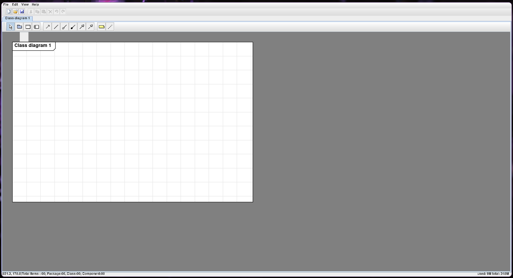
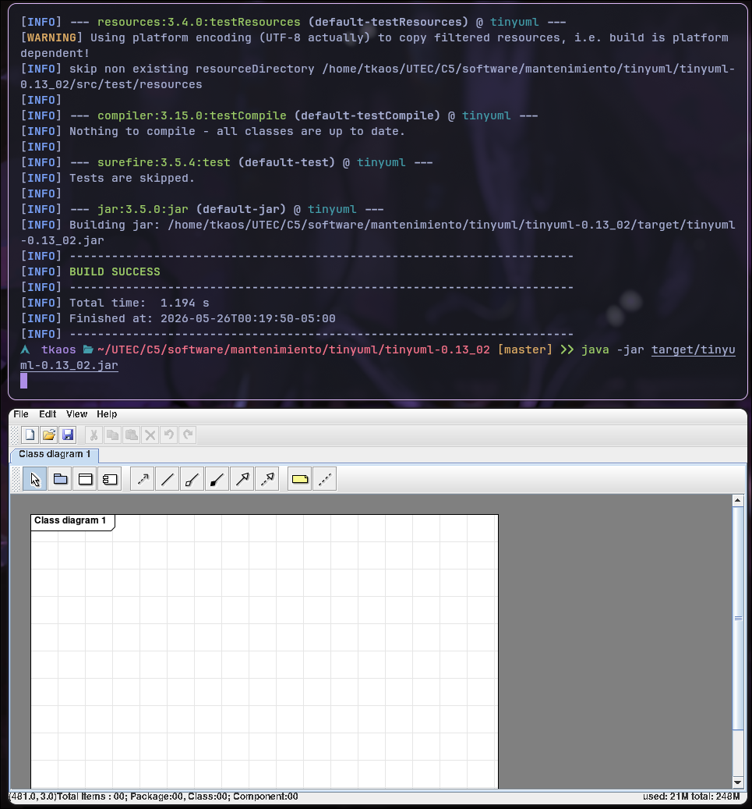
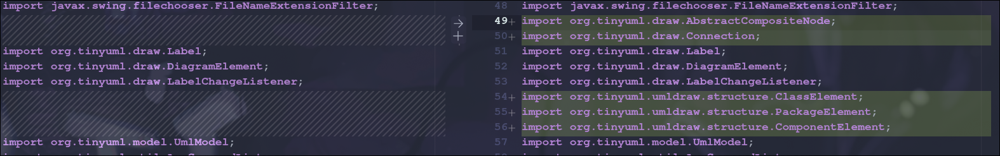
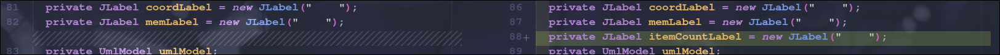
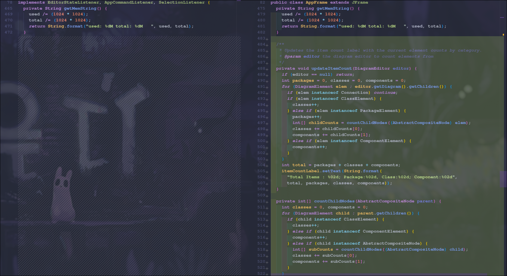

# Implementación





# Cambios realizados

## RF-001: Contador de elementos en la barra de tareas

### `tinyuml-0.13_02/src/main/java/org/tinyuml/ui/AppFrame.java`

**Nuevos imports agregados:**
```java
import org.tinyuml.draw.AbstractCompositeNode;
import org.tinyuml.draw.Connection;
import org.tinyuml.umldraw.structure.ClassElement;
import org.tinyuml.umldraw.structure.PackageElement;
import org.tinyuml.umldraw.structure.ComponentElement;
```


**Nuevo campo:**
```java
private JLabel itemCountLabel = new JLabel("    ");
```


**installStatusbar()** — se agregó `itemCountLabel` al centro del panel:
```java
private void installStatusbar() {
    JPanel statusbar = new JPanel(new BorderLayout());
    statusbar.add(coordLabel, BorderLayout.WEST);
    statusbar.add(itemCountLabel, BorderLayout.CENTER);
    statusbar.add(memLabel, BorderLayout.EAST);
    getContentPane().add(statusbar, BorderLayout.SOUTH);
}
```

**updateItemCount()** — cuenta elementos del diagrama por tipo:
```java
private void updateItemCount(DiagramEditor editor) {
    if (editor == null) return;
    int packages = 0, classes = 0, components = 0;
    for (DiagramElement elem : editor.getDiagram().getChildren()) {
        if (elem instanceof Connection) continue;
        if (elem instanceof ClassElement) classes++;
        else if (elem instanceof PackageElement) {
            packages++;
            int[] childCounts = countChildNodes((AbstractCompositeNode) elem);
            classes += childCounts[0];
            components += childCounts[1];
        } else if (elem instanceof ComponentElement) components++;
    }
    int total = packages + classes + components;
    itemCountLabel.setText(String.format(
        "Total Items : %02d; Package:%02d, Class:%02d; Component:%02d",
        total, packages, classes, components));
}
```



**countChildNodes()** — conteo recursivo para elementos dentro de paquetes:
```java
private int[] countChildNodes(AbstractCompositeNode parent) {
    int classes = 0, components = 0;
    for (DiagramElement child : parent.getChildren()) {
        if (child instanceof ClassElement) classes++;
        else if (child instanceof ComponentElement) components++;
        else if (child instanceof AbstractCompositeNode) {
            int[] subCounts = countChildNodes((AbstractCompositeNode) child);
            classes += subCounts[0];
            components += subCounts[1];
        }
    }
    return new int[] { classes, components };
}
```

**Disparadores de actualización** — se agregaron llamadas a `updateItemCount()` en:
- `elementAdded()` — al agregar elemento al diagrama
- `elementRemoved()` — al eliminar elemento del diagrama
- `newModel()` — al crear nuevo modelo (después de `createEditor`)
- `openModel()` — al abrir modelo existente (después de `createEditor`)

---

### `tinyuml-0.13_02/pom.xml`

Se actualizó la configuración del compilador de Java 6 a Java 8 para compatibilidad con el entorno actual (JDK 21):
```xml
<source>1.8</source>
<target>1.8</target>
```

